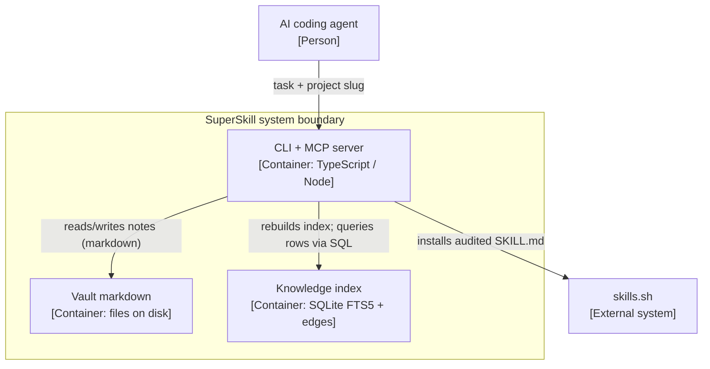
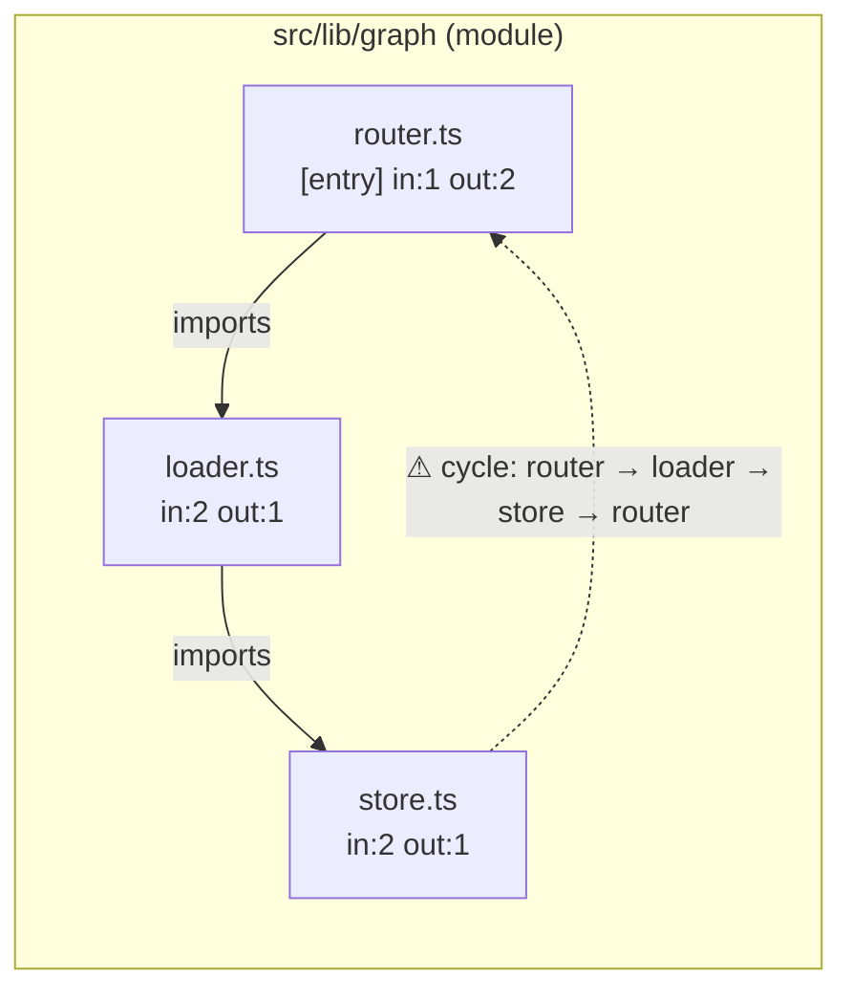
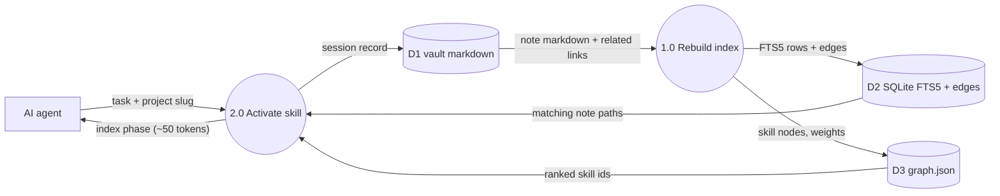

# Diagram conventions

Rules for superskill's generated diagrams (`diag:high`, `diag:low`, `diag:flow`, `diag:erd`) and the contract
AI agents can rely on when consuming them. Sources are cited inline as URLs; the full list is at the bottom.

## 0. Universal rules (every diagram)

1. **One abstraction level per diagram.** Never mix context, container, component, and code in one picture
   ([c4model.com/diagrams](https://c4model.com/diagrams)).
2. **Title = type + scope**, e.g. "Container diagram for SuperSkill" ([notation](https://c4model.com/diagrams/notation)).
3. **Draw the boundary** — the system in scope plus the external actors/systems it talks to
   ([system context](https://c4model.com/diagrams/system-context)).
4. **Legend/key in words**: every shape, colour, line style, and arrow head encoding spelled out; the diagram should be
   mostly understandable without a narrative ([notation](https://c4model.com/diagrams/notation),
   [checklist](https://c4model.com/diagrams/checklist)).
5. **Every element is named, typed, and has a one-line responsibility**; containers/components state their technology
   ([notation](https://c4model.com/diagrams/notation)).
6. **Every relationship is unidirectional and labelled** with direction-consistent intent — "reads note markdown",
   never bare "Uses" ([notation](https://c4model.com/diagrams/notation)).
7. **Keep it small.** Define the scope first and split instead of cramming; separate layers rather than everything at once
   ([AWS Builder Center](https://builder.aws.com/content/3DttzYU07FWj09CqNczGbfSnYF4/how-to-design-better-aws-architecture-diagrams));
   simplify rather than over-document ([Google Cloud WAF](https://docs.cloud.google.com/architecture/framework)).
8. **Deterministic output:** stable, sorted node/edge order; identical inputs produce an identical diagram.
9. **Every Mermaid block has a text twin** (table or list) generated from the same model (§4.5).

## 1. HLD — C4 Level 1 (context) + Level 2 (container)

### L1 system context

- The software system in scope is **one box in the centre**; people (roles/personas) and external software systems surround it
  ([system context](https://c4model.com/diagrams/system-context)).
- No technology, protocol, or low-level detail; audience is non-technical ([system context](https://c4model.com/diagrams/system-context)).

### L2 container

- A container is an **application or a data store**: CLI, server, SPA, database schema, folder on disk, bucket
  ([container](https://c4model.com/diagrams/container)).
- Show responsibilities, major **technology choices**, and how containers communicate ([container](https://c4model.com/diagrams/container)).
- Supporting elements: people and external systems directly connected; deployment details (clustering, replication)
  belong in deployment diagrams, not here ([container](https://c4model.com/diagrams/container)).
- Externals sit outside the boundary subgraph; the system boundary is explicit
  ([system context](https://c4model.com/diagrams/system-context)).

### Naming rules

- Elements are **nouns** ("Knowledge index", "Vault markdown"); relationships are **verbs** ("indexes", "reads/writes");
  acronyms are explained in the legend ([notation](https://c4model.com/diagrams/notation)).
- Inter-process relationships (container → container) name the **technology/protocol** in the label ([notation](https://c4model.com/diagrams/notation)).

### Mermaid example (C4-ish)

Mermaid's C4 diagrams are experimental and have no legend support ([Mermaid C4](https://mermaid.js.org/syntax/c4.html)),
so use a `flowchart` with a boundary subgraph and stereotyped labels — it renders everywhere Mermaid runs.

## 2. LLD — component/module dependency view

- **Scope:** inside one container (our repo/CLI). Component diagrams decompose a single container and add
  responsibilities plus implementation detail; they are optional and worth automating
  ([component](https://c4model.com/diagrams/component)).
- **Nesting:** layer → module → file. One box per module at module level, one box per file at file level; never mix
  both granularities in one view.
- **Direction:** arrows point **dependent → dependency** (importer → imported), stated in the legend; unidirectional
  and labelled ([notation](https://c4model.com/diagrams/notation)).
- **Labels:** `imports`, `references types`, or aggregated `imports ×3`; an unlabelled arrow is a defect (§4.4).
- **Interfaces vs implementations:** entry points (CLI commands, MCP tools) carry an `[entry]` stereotype; dashed edges
  mean type-only/interface references. Dependencies through internals are not drawn — only through exported surfaces.
- **Fan-in/out:** annotate boxes `in:N out:M`. High fan-in = stable shared dependency; high fan-out = fragile
  orchestrator; both inform refactoring (decoupling is a first-class design goal —
  [Google Cloud WAF](https://docs.cloud.google.com/architecture/framework)).
- **Cycles flagged, never silent:** a back-edge closing a cycle is drawn dashed with label
  `⚠ cycle: a → b → a` and listed in the twin.
- **Runtime order does not live in a dependency graph.** For key flows (activate, init, learn) add a Mermaid
  `sequenceDiagram` in the same doc, messages in call order ([Mermaid sequence](https://mermaid.js.org/syntax/sequenceDiagram.html)).

- **File granularity:** files nest as subgraphs under their module; test/spec/fixture files are excluded consistently.

## 3. DFD — data flow diagrams

### Symbols and naming (exactly four elements)

- **External entity** (terminator): rectangle; a person, org, or system outside the boundary that supplies/receives
  data and never processes it ([Wikipedia](https://en.wikipedia.org/wiki/Data-flow_diagram),
  [agilemodeling](https://www.agilemodeling.com/artifacts/dataFlowDiagram.htm)).
- **Process**: a transformation; named verb + singular noun ("Validate note") with an id. Yourdon–DeMarco draws it as a
  **circle**; Gane–Sarson as a **rounded rectangle** ([Visual Paradigm](https://www.visual-paradigm.com/guide/data-flow-diagram/what-is-data-flow-diagram/)).
- **Data store**: retained data, named as a plural noun ("notes"); Y/D = **two parallel lines**, G/S = open-ended rectangle.
- **Data flow**: labelled arrow; the label is a **noun phrase naming what moves** ("note markdown (path, type, body)"),
  not how; one kind of data per flow; bidirectional only for logically paired flows (question/answer)
  ([Wikipedia](https://en.wikipedia.org/wiki/Data-flow_diagram)).

### Structural rules

- **No control flow**: no decisions, no loops, no conditions — those belong in flowcharts
  ([Wikipedia](https://en.wikipedia.org/wiki/Data-flow_diagram)).
- Every process has **≥1 input and ≥1 output**; no black holes (inputs only) or miracles (outputs only)
  ([Visual Paradigm](https://www.visual-paradigm.com/guide/data-flow-diagram/what-is-data-flow-diagram/),
  [agilemodeling](https://www.agilemodeling.com/artifacts/dataFlowDiagram.htm)).
- Every data store and external entity touches ≥1 flow; a flow must attach to at least one process
  ([agilemodeling](https://www.agilemodeling.com/artifacts/dataFlowDiagram.htm)).
- Illegal: entity→entity, entity→store, store→store without a process in between
  ([Visual Paradigm](https://www.visual-paradigm.com/guide/data-flow-diagram/what-is-data-flow-diagram/)).
- A store has ≥1 input and ≥1 output flow ([agilemodeling](https://www.agilemodeling.com/artifacts/dataFlowDiagram.htm));
  stores appear at the highest level where they are first used and on every lower level too
  ([Wikipedia](https://en.wikipedia.org/wiki/Data-flow_diagram)).

### Levels

- **Level 0 (context):** the whole system as exactly one process, all external entities, **no stores**; fits one page
  ([Wikipedia](https://en.wikipedia.org/wiki/Data-flow_diagram),
  [Visual Paradigm](https://www.visual-paradigm.com/guide/data-flow-diagram/what-is-data-flow-diagram/)).
- **Level 1:** decomposes the context process; number processes 1..n consistently across levels (1, 1.1, 1.1.1)
  ([Wikipedia](https://en.wikipedia.org/wiki/Data-flow_diagram)); **3–9 processes per level** (7±2)
  ([Visual Paradigm](https://www.visual-paradigm.com/guide/data-flow-diagram/what-is-data-flow-diagram/)).
- **Balancing:** level 0 and level 1 conserve the system's inputs/outputs — same external flows, same data; names are
  unique across levels ([Visual Paradigm](https://www.visual-paradigm.com/guide/data-flow-diagram/what-is-data-flow-diagram/)).

### Notation choice: Yourdon–DeMarco

Pick **Y/D** because (a) Mermaid ships a first-class `datastore` shape documented as the "data flow diagram data store"
— the two parallel lines — alongside circle processes, so the mapping is exact with zero custom styling
([Mermaid flowchart](https://mermaid.js.org/syntax/flowchart.html)); (b) Gane–Sarson's open-ended store has no Mermaid
primitive; (c) DeMarco's structured-analysis reference is the canonical description of the symbol set
([Wikipedia](https://en.wikipedia.org/wiki/Data-flow_diagram)). Difference summary: process circle vs rounded rectangle,
store two-lines vs open-ended rectangle; the entity is a rectangle in both, though G/S squares are common
([agilemodeling](https://www.agilemodeling.com/artifacts/dataFlowDiagram.htm)). On Mermaid < 11.3 fall back to the
cylinder `[( )]` and say so in the legend.

## 4. Rules for AI-agent consumption

1. **Stable machine-readable ids.** Every node id is a canonical path or system id: `src/lib/graph/router.ts`, `D1`,
   `P2`, `EXT:skills.sh`. Ids are generated injectively (escape, never strip: `a-b.ts` and `a_b.ts` must stay distinct),
   never derived from display titles, and stable across regenerations. Titles are cosmetic; ids are the API.
2. **Deterministic generation.** Sort nodes by id and edges by (from, to, label); identical inputs → byte-identical
   output; no timestamps, no randomness, no map-iteration order.
3. **Textual legends.** Legend lines must read as sentences: "circle = process", "solid arrow = data flow, label = data
   that moves", "dashed arrow = flagged dependency cycle". Colour alone is decorative and must never be the only carrier
   of meaning (grayscale/colour-blind safe — [C4 notation](https://c4model.com/diagrams/notation)).
4. **Every edge carries a verb and a count.** `imports ×3`, `reads 42 notes`, `writes 6 records`,
   `relevance w=0.9 from 47 activations`. When a count is unknown, still label the verb.
5. **Text twin after every diagram.** Emit a markdown table/list `from | to | label | count` from the same in-memory
   model; agents read the twin, humans read the picture, and they cannot drift. Mermaid `accTitle:`/`accDescr:` add an
   accessible SVG title/description ([Mermaid accessibility](https://mermaid.js.org/config/accessibility.html)) —
   additive, not a replacement.
6. **No purely decorative encodings.** If colour, size, or position encodes something, it is stated in the legend and
   twin; if it cannot be stated, drop it.
7. **Token-budget annotations.** Flows that put data into an LLM context carry their budget in the label:
   `|"graph INDEX (~50 tokens)"|`, `|"skill content (≤800 tokens)"|`, `|"task + neighborhood ~150 tokens"|`, matching
   the router's budget model ([design spec](../superpowers/specs/2026-04-23-knowledge-graph-design.md)).
8. **Renderability is a gate.** Every block parses with the pinned Mermaid version or generation fails; mind Mermaid's
   constraints (quote labels with special characters, avoid bare `end` — [Mermaid flowchart](https://mermaid.js.org/syntax/flowchart.html)).

## 5. Mapping onto generated artifacts

| Artifact | Diagram | Rules |
| --- | --- | --- |
| `diag:high` | C4-style HLD: L1 context + L2 containers, two titled sections | §1; externals = AI agent, user, skills.sh, filesystem; containers carry technology + one-line responsibility; every arrow labelled with what flows and, where applicable, the protocol |
| `diag:low` | Component/module dependency LLD: layer → module → file nesting | §2; arrows dependent → dependency, labelled `imports`; fan-in/out on modules; cycles flagged; `sequenceDiagram` for the activate flow |
| `diag:flow` (new) | Two-level DFD: level 0 context + level 1 decomposition | §3; Y/D symbols; details below |
| `diag:erd` | Existing ERD | unchanged; keep Mermaid `erDiagram`, singular entity names, crow's-foot cardinality ([Mermaid ER](https://mermaid.js.org/syntax/entityRelationshipDiagram.html)) |

`diag:flow` content:

- **Level 0:** one process "SuperSkill", external entities = AI coding agent + user; no stores
  ([Wikipedia](https://en.wikipedia.org/wiki/Data-flow_diagram)).
- **Level 1 processes:** P1 Rebuild index (init/index), P2 Activate (route + load), P3 Learn (close session/learn),
  P4 Visualize (viz + canvas) — inside the 3–9 range ([Wikipedia](https://en.wikipedia.org/wiki/Data-flow_diagram)).
- **Stores:** D1 vault markdown (source of truth), D2 SQLite FTS5 + edges (derived index),
  D3 `.superskill/graph.json` (routing graph; 200–500 token target — [design spec](../superpowers/specs/2026-04-23-knowledge-graph-design.md)).
- **Flow labels name the data:** "note markdown (path, type, title, body)", "FTS5 rows + edges",
  "relevance edges {w, activations}", "audit status (gen/socket/snyk)", "skill content (SKILL.md body)",
  "session record (intent, files, outcome)".
- **Balancing:** every level-0 flow appears at level 1 with the same data; no new external flows appear at level 1
  ([Visual Paradigm](https://www.visual-paradigm.com/guide/data-flow-diagram/what-is-data-flow-diagram/)).

## 6. Review checklist (apply before shipping)

1. Title names diagram type + scope; exactly one abstraction level.
2. Boundary + external actors/systems drawn; nothing outside scope leaks in.
3. Every element is named, typed, and has a responsibility line; containers/components state technology.
4. Every arrow is unidirectional, its direction is stated, label = verb + object, counts where known; no bare "uses".
5. Legend exists and is textual: each shape/line/colour reads as a sentence; survives grayscale.
6. Text twin present, edge-for-edge identical to the drawing, generated from the same model.
7. Ids are stable, path-like, injective; retitling changes no id.
8. LLD: dependency direction is dependent → dependency; cycles flagged with the cycle spelled out; fan-in/out annotated.
9. DFD: no control flow; processes verb-named with ≥1 in/out; stores plural-named with ≥1 in/out; no entity↔entity or
   store↔store; levels balanced; 3–9 processes.
10. LLM-bound flows carry token budgets.
11. Regeneration is deterministic: same inputs, no diff.
12. Every Mermaid block parses with the pinned version.

## Sources

- C4 model: [home](https://c4model.com/), [diagrams](https://c4model.com/diagrams), [system context](https://c4model.com/diagrams/system-context), [container](https://c4model.com/diagrams/container), [component](https://c4model.com/diagrams/component), [notation](https://c4model.com/diagrams/notation), [checklist](https://c4model.com/diagrams/checklist)
- Data-flow diagram, Wikipedia: https://en.wikipedia.org/wiki/Data-flow_diagram
- Agile Modeling, DFD: https://www.agilemodeling.com/artifacts/dataFlowDiagram.htm
- Visual Paradigm, DFD guide: https://www.visual-paradigm.com/guide/data-flow-diagram/what-is-data-flow-diagram/
- Google Cloud Well-Architected Framework: https://docs.cloud.google.com/architecture/framework
- AWS Builder Center, How to Design Better AWS Architecture Diagrams: https://builder.aws.com/content/3DttzYU07FWj09CqNczGbfSnYF4/how-to-design-better-aws-architecture-diagrams
- Mermaid: [flowchart](https://mermaid.js.org/syntax/flowchart.html), [C4](https://mermaid.js.org/syntax/c4.html), [sequence](https://mermaid.js.org/syntax/sequenceDiagram.html), [ER](https://mermaid.js.org/syntax/entityRelationshipDiagram.html), [accessibility](https://mermaid.js.org/config/accessibility.html)
- superskill knowledge graph design spec: `docs/superpowers/specs/2026-04-23-knowledge-graph-design.md`
